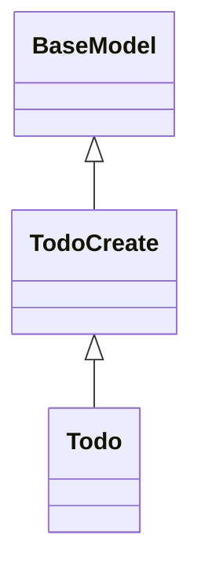

## Todo REST Service
````markdown
## Todo REST Service

A RESTful web service using FastAPI.
The service handles HTTP GET, POST, UPDATE, DELETE, and OPTIONS
methods for a "/todo" endpoint.

### Code Organization

| File                 | Contents           |
|:---------------------|:-------------------|
| `models.py`          | Classes for Todo and TodoCreate. Used for serialization and input validation. |
| `persistence.py`     | `TodoDao` class provides persistence for Todo objects. |
| `main.py`            | FastAPI code to run the application. |

## How to Build and Run

1. Install required packages in a virtual env.
   You can also create a venv in VS Code, which may be easier.
   ```shell
   $ python -m venv env
   # Activate the venv. This is for Linux & MacOS.  
   . env/bin/activate
   (env)$ pip install -r requirements.txt
   ```

2. Run the app using uvicorn:
   ```shell
   (env)$ uvicorn main:app --reload
   ```

3. Navigate to <http://127.0.0.1:8000/docs>. (Sorry, no html UI yet.)

   - You should see OpenAPI style documentation of the endpoints.
   - Click the "try it" button to input values and submit a request.

4. Stop the application by pressing CTRL-C or close the window.

## Class Diagram

The class hierarchy for the Pydantic models is:


